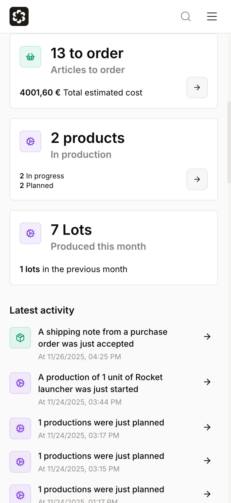
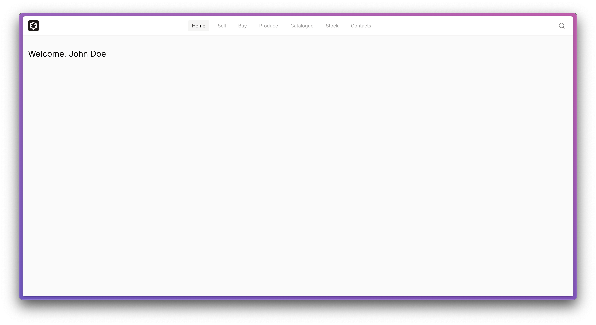

# Coding challenge

This is the coding challenge for the Frontend Engineer role.

## Important

Treat this as production code that needs to ship. Please break down your work into multiple commits so we can review your approach and implementation process. Write clean, maintainable code that follows the patterns already established in the project. Don't overthink it—just do what you'd normally do on the job!

## Time expectation

Our appetite for this feature is ~2-3 hours, but we understand you might now be familiar with SvelteKit, so do not worry if you spend more time on it. We value your time and designed this to be completable within that timeframe. When submitting, let us know roughly how long you spent (no penalty if you go over, we'd just like to know!) 🙌

## The Goal

Your task is to build the homepage dashboard page (or at least part of it). We'd like the page to look like this:

| Desktop                            | Mobile                           |
| ---------------------------------- | -------------------------------- |
|  |  |

You'll be given the skeleton of the page, which initially looks like this:



The notifications list is already implemented. You'll find the markup available and commented out in `src/routes/app/(index)/+page.svelte`.

### What to Build

Focus on implementing the 7 KPI cards:

- **Active sales**: Show currently active sales orders with a breakdown: X shipping in progress and Y shipping not started (suggestion: `order.status === OrderSummaryStatusEnum.Sent`, `order.status === OrderSummaryStatusEnum.Accepted`)
- **Sales of this month**: Display the sales amount for the current month compared to the previous month
- **Active purchases**: Show currently active purchase orders with a breakdown: X orders sent but not approved, and Y orders confirmed pending delivery
- **Purchases of this month**: Display the amount spent this month compared to the previous month
- **Articles to order**: Show the number of articles that need to be purchased, along with the total estimated cost
- **Production status**: Display the number of items currently in production with a breakdown: X in progress, Y planned
- **Production numbers**: Show the number of lots produced this month compared to the previous month

### API Endpoints

Below you'll find details about the endpoints to use for each card. To simplify environment setup, these endpoints don't perform actual HTTP requests—they use mocked responses instead. However, the returned types will give you the interface of the objects you'll receive from each endpoint.

## 1. Active sales block

### API details

```typescript
import { DefaultApi } from '$api/sales'
import { createClientApiConfig } from '$api/clients-utils/sales-client-side'

const salesOrdersApi = new DefaultApi(createClientApiConfig())
const activeSalesOrders = await salesOrdersApi.listActiveOrders()
```

### returns `Promise<ActiveOrder[]>`

See details in the file: `src/lib/api-client/sales/models/ActiveOrder.ts`

---

## 2. Sales of this month block

### API details

```typescript
import { DefaultApi } from '$api/sales'
import { createClientApiConfig } from '$api/clients-utils/sales-client-side'

const salesOrdersApi = new DefaultApi(createClientApiConfig())
await salesOrdersApi.lastTwoMonthSales()
```

### returns `Promise<MonthlySales[]>`

See details in the file: `src/lib/api-client/sales/models/MonthlySales.ts`

---

## 3. Active purchases block

### API details

```typescript
import { OrdersApi } from '$api/supply'
import { createClientApiConfig } from '$api/clients-utils/supply-client-side'

const purchaseOrdersApi = new OrdersApi(createClientApiConfig())
const activeOrders = await purchaseOrdersApi.listActiveOrders()
```

### returns `Promise<PurchaseOrderSummary[]>`

See details in the file: `src/lib/api-client/supply/models/PurchaseOrderSummary.ts`

---

## 4. Purchases of this month block

### API details

```typescript
import { DefaultApi } from '$api/supply'
import { createClientApiConfig } from '$api/clients-utils/supply-client-side'

const supplyApi = new DefaultApi(createClientApiConfig())
await supplyApi.lastTwoMonthPurchases()
```

### returns `Promise<MonthlyPurchases[]>`

See details in: `src/lib/api-client/supply/models/MonthlyPurchases.ts`

---

## 5. Articles to order block

### API details

```typescript
import { AnalyticsApi } from '$api/supply'
import { createClientApiConfig } from '$api/clients-utils/supply-client-side'

const analyticsApi = new AnalyticsApi(createClientApiConfig())
const needs = await analyticsApi.showSupplyNeeds()
counts = calculateSelectionCounts(
  needs.map(item => ({
    selected: true,
    o: item,
    id: item.id as string,
    activeAlternative: item,
  })),
)
```

### returns `Promise<MissingRawMaterial[]>`

See details in: `src/lib/api-client/supply/models/MissingRawMaterial.ts`

---

## 6. Production status block

### API details

```typescript
import { AnalyticsApi } from '$api/product'
import { createClientApiConfig } from '$api/clients-utils/product-client-side'

const productionApi = new AnalyticsApi(createClientApiConfig())
const productionItems = await productionApi.getActiveProduction()
```

### returns `Promise<ProductionItem[]>`

See details in: `src/lib/api-client/product/models/ProductionItem.ts`

---

## 7. Production numbers block

### API details

```typescript
import { DefaultApi } from '$api/product'
import { createClientApiConfig } from '$api/clients-utils/product-client-side'

const productionApi = new DefaultApi(createClientApiConfig())
await productionApi.lastTwoMonthProduction()
```

### returns `Promise<MonthlyProduction[]>`

See details in the file: `src/lib/api-client/product/models/MonthlyProduction.ts`

## Styles

1. The background of each card, you can use `bg-background`
2. The icons:

- Green:
  backgorund: `emerald-500/10`
  border: `emerald-500/20`
  text: `emerald-600`

- Pink:
  backgorund: `pink-500/10`
  border: `pink-500/20`
  text: `pink-600`

- Violet:
  backgorund: `violet-500/10`
  border: `violet-500/20`
  text: `violet-600`

## Deliverable

1. Fork this repository into a private repository named `mini-arke-frontend`
2. Implement the dashboard as explained above
3. Implement unit tests, if you think it's worth
4. Add @gufoscuro as collaborator to your private repo
5. Send us the link to your private repository

## What comes next?

The next step will be a 45-60 minute technical session where we'll work together on top of the code you submitted. This could be expanding the feature, writing tests, or something similar. Make sure to keep the project running on your local environment so we can dive right in.

After the technical portion, we'll spend some time getting to know each other better, learning about your background, what you're looking for in your next role, and answering any questions you have about the team and how we work. We'll follow up with you for next steps!

## Questions?

If you have any questions about the assignment, feel free to reach out!

We can't wait to see your submission! Good luck! 🚀

## Your notes

Feel free to add your notes here if you'd like to explain the rationale behind your implementation choices.
